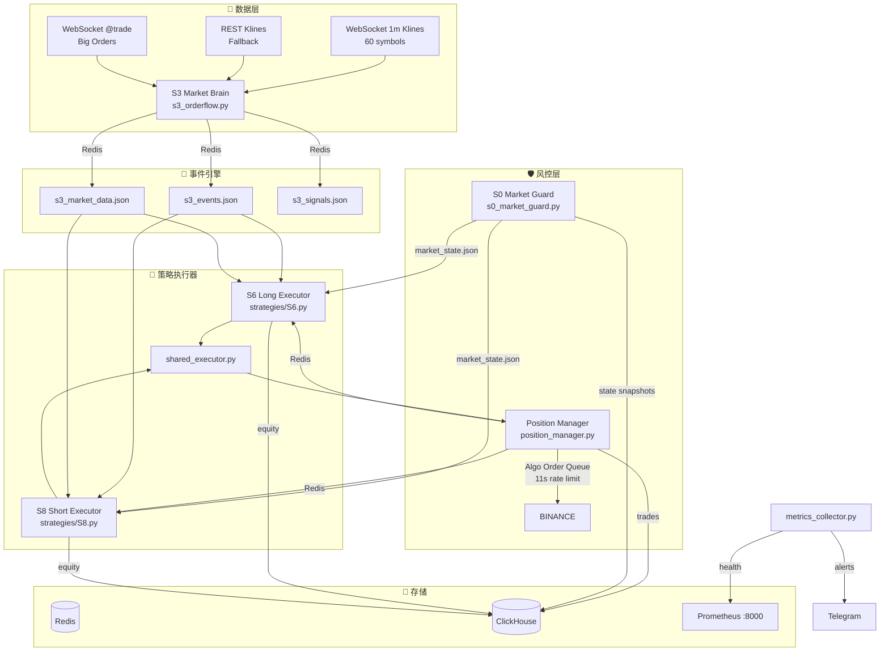

# Trading Engine

Automated Binance Futures trading system with event-driven strategies, unified position management, and multi-layered risk controls.

## Architecture



## Data Flow

```
S3 Market Brain (WebSocket 1m klines)
  │
  ├── detect_events() → PULSE_UP/DOWN, TREND_UP/DOWN, PANIC_SELL, ...
  │
  ├── Redis Publish ──► S6 (Long) / S8 (Short)
  │                       │
  │                       ├── read_s3_events()
  │                       ├── read_s3_market_data()
  │                       ├── calc_position_qty()
  │                       └── open_position() → PM
  │
  ├── Redis Publish ──► Position Manager
  │                       │
  │                       ├── Hard Stop Loss
  │                       ├── ATR Trailing Stop
  │                       ├── Breakeven (be_done)
  │                       ├── Time Stop / Extend
  │                       ├── Funding Rate Guard
  │                       └── Ghost Position Cleanup
  │
  └── S0 Market Guard (30s cycle)
                          │
                          ├── BTC Trend (4h EMA20/60)
                          ├── Market Breadth (top 50)
                          ├── Altcoin Sync
                          ├── Shock Score
                          └── Regime: bull/weak_bull/range/weak_bear/risk-off
```

## Systems

| System | Role | Signals |
|--------|------|---------|
| **S3** | Market Brain — event detection engine | PULSE_UP/DOWN, TREND_UP/DOWN, PANIC_SELL, VIOLENT_MOVE, FAILED_BREAKOUT |
| **S6** | Long executor | Consumes LONG events, opens long positions |
| **S8** | Short executor | Consumes SHORT events, opens short positions |
| **S0** | Macro market state machine | Controls per-system trading permissions |
| **PM** | Unified position lifecycle manager | Stop loss, trailing, time stop, algo orders |

## Event Types

| Event | Description |
|-------|-------------|
| `PULSE_UP / PULSE_DOWN` | Short-term momentum burst (5x isolated) |
| `TREND_UP / TREND_DOWN` | Sustained trend (3x crossed) |
| `PANIC_SELL` | Panic selling detected (5x isolated short) |
| `VIOLENT_MOVE` | Extreme volatility event |
| `FAILED_BREAKOUT` | Failed breakout reversal signal |
| `HIGH_VOL / LOW_VOL` | Volume anomaly detection |

## Position Manager Features

- **Hard Stop Loss** — Fixed percentage stop on entry
- **Breakeven (be_done)** — Moves SL to entry price when profit target hit
- **ATR Trailing Stop** — Professional trailing with pump detection, multi-period ATR, EMA20 safety valve
- **Time Stop** — Auto-close after max hold time with extension logic
- **Funding Rate Guard** — Closes positions when funding rates turn unfavorable
- **Algo Order Queue** — Background thread with 11s spacing for rate-limited conditional orders
- **Ghost Cleanup** — Detects and records positions that exist in local state but not on exchange

## Tech Stack

- **Language:** Python 3.11+
- **Data:** Redis (primary), JSON files (fallback)
- **Analytics:** ClickHouse (trade history, market snapshots, equity tracking)
- **Monitoring:** Prometheus (`:8000/metrics`) + Telegram alerts
- **Exchange:** Binance Futures API (FAPI)

## Configuration

Edit `config/binance.env`:

```env
BINANCE_API_KEY=your_key
BINANCE_API_SECRET=your_secret
TG_BOT_TOKEN=your_telegram_bot_token
TG_CHAT_ID=your_chat_id
```

### Sandbox Mode

```bash
# Enable
touch strategies/config/SANDBOX_MODE

# Reset state
python3 -c "import scripts.sandbox as sb; sb.reset()"

# View status
python3 -c "import scripts.sandbox as sb; print(sb.summary())"
```

When sandbox mode is active, all order and position API calls are intercepted by `scripts/sandbox.py`, using real-time prices from Binance public endpoints for simulated P&L calculations.

## Quick Start

```bash
# Install dependencies
pip install redis requests websocket-client prometheus-client python-dotenv

# Start Redis & ClickHouse
sudo systemctl start redis-server
sudo clickhouse start

# Run S3 Market Brain
python3 strategies/s3_orderflow.py

# Run S6 Long Executor
python3 strategies/S6.py

# Run S8 Short Executor
python3 strategies/S8.py

# Run S0 Market Guard
python3 services/s0/s0_market_guard.py

# Start monitoring
python3 monitoring/metrics_collector.py
```
