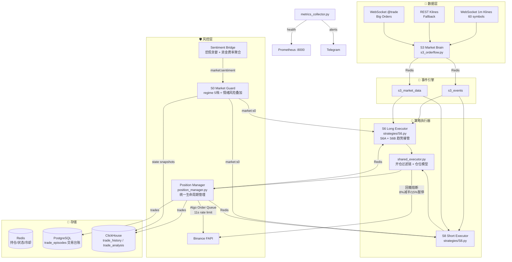

# Trading Engine

Automated Binance Futures trading system with event-driven strategies, unified position management, and multi-layered risk controls (signal quality gates → account-level breakers → real-time profit locks).

## Architecture



## Entry Pipeline

Every S3 event passes through a fixed gate chain before an order is placed. Any gate can reject the signal:

```
S3 Event (symbol, type, strength)
  │
  ├─ S8 (Short)                              ├─ S6 (Long)
  │   ├─ 事件过期 / 180s 重复冷却              │   ├─ 事件过期 / 180s 重复冷却
  │   ├─ 短空强度门槛: TREND_DOWN /           │   ├─ VIOLENT_BULLISH 在
  │   │  VIOLENT_BEARISH / PULSE_DOWN        │   │  weak_bear / risk-off
  │   │  要求 raw_strength ≥ 60               │   │  regime 下拒绝
  │   └─ PUMP_DOWN 高周期逆势保护             │   └─ S6B 趋势接管需回踩确认
  │
  ├─ 共同过滤（S6/S8）
  │   ├─ 左右侧入场分类 (LEFT_REVERSAL / RIGHT_MOMENTUM / UNCONFIRMED)
  │   ├─ 趋势过滤: 价格 vs 1h EMA20（顺大势才入场）
  │   ├─ 追高/追空保护: 距 EMA20 超过 1.25~2.0 ATR 拒绝
  │   ├─ 波动率过滤: 1h ATR% > 6% 跳过
  │   └─ 仓位上限 / 冷却期 / 已有持仓检查
  │
  └─ open_position()（shared_executor.py）
      ├─ strength ≥ 30 基础门槛
      ├─ 历史分析过滤: 同 (symbol, event_type, system) 14天滚动
      │   胜率/质量/T60复盘劣化 → 拒单或降权
      ├─ R:R 预判: 预期延续幅度 / 止损距离 ≥ 1.0
      ├─ 账户回撤熔断（见下）
      ├─ 4h 内平仓过的标的不重开
      ├─ 全局暂停开关 (strategies/config/PAUSE_OPEN)
      └─ 仓位模型: 余额×80% 池化 → 评分分配(3~15%) →
          ATR 衰减 → 单笔止损 ≤ 账户 1% 硬约束
```

## Position Lifecycle (PM)

All open positions are managed by `position_manager.py` on every monitor cycle. Checks run in order:

| # | Check | Parameters (S8A) |
|---|-------|------------------|
| 0 | Symbol filter — only `*USDT` contracts are managed (legacy `*_PERP` never enter monitoring/alerts) | — |
| 1 | Funding rate guard — force close on extreme funding | ±0.5% |
| 2 | Hard stop loss (exchange algo SL breach) | entry ±3.5~8%, ATR-adaptive |
| 3 | Emergency stop (polled fallback) | pnl < -5% |
| 4 | Early-loss protection — cut after grace period when 15m momentum still adverse | hold ≥ 5min, pnl ≤ -2% |
| 5 | Stagnant profit release | 90min, < 1U |
| 6 | Breakeven (`be_done`) — SL to entry | +2% |
| 7 | Partial take-profit (layered) | {5%: 30%} |
| 8 | ATR trailing stop — chandelier anchored on extremes, 15m close confirmation, pump ×1.5 spacing, EMA20 safety valve | 0.3×ATR |
| 9 | **Peak pullback guard** — once profit ≥ trigger, tracks the extreme every cycle and ratchets a locked-profit SL onto the exchange in real time (no 15m wait); closes immediately if pullback from peak ≥ threshold | trigger +3%, pullback 2% |
| 10 | 1h EMA safety valve — trend reversal exit (skipped for first 60min / pnl ≥ 40%) | EMA9 vs EMA20 ×2% |
| 11 | Time stop with extension logic (RSI + funding) | 240min |

Per-system overrides live in `SYSTEM_CFG` (`position_manager.py`): S8A / S8B / S6A / S6B / S6, e.g. S6B (trend takeover) gets wider stops, longer time stop, and a looser peak guard (+5% / 3%).

## Account Risk Controls

- **Drawdown breaker** (`shared_executor.py`) — equity peak tracked in Redis:
  - drawdown ≥ 8% → position size ×0.5
  - drawdown ≥ 15% → halt opens 4h, then recovery mode (size ×0.25, max 1 position); a further -2% locks again for 6h
- **Per-trade risk cap** — stop distance × leverage ≤ 1% of account balance
- **Pool budget** — max 80% of balance in the position pool, max 15% of pool per position
- **Algo SL queue** — exchange conditional orders updated through a background queue with 11s spacing and 60s/0.2% change throttling

## Data & Telemetry

| Store | Tables | Role |
|-------|--------|------|
| Redis | `pm:positions`, `market:s0`, `market:sentiment`, `state:s6/s8`, `account:peak` | Live state, cooldowns, breakers, sentiment |
| PostgreSQL | `trade_episodes`, `trade_events` (+ `trade_episode_attribution` view) | Transactional ledger; every open/close fill carries `decision_context` (signal_type, entry_mode, raw_strength, orderflow …) |
| ClickHouse | `trade_history`, `trade_analysis` (T0/T15/T60), `s0 snapshots` | Analytics: MFE/MAE, exit efficiency, quality score, post-close replay |

Closed trades record their opening `signal_type` from PM position metadata, so signal-level attribution and the rolling analysis filter work end-to-end.

## Systems

| System | Role | Signals |
|--------|------|---------|
| **S3** | Market Brain — event detection engine | PULSE_UP/DOWN, TREND_UP/DOWN, PANIC_SELL, VIOLENT_BULLISH/BEARISH, PUMP_UP/DOWN, FAILED_BREAKOUT |
| **S6** | Long executor — S6A (pulse/trend/violent longs) + S6B (pump trend takeover) | LONG events |
| **S8** | Short executor | SHORT events, strength-gated |
| **S0** | Macro market state machine + sentiment risk overlay | regime: bull_trend / weak_bull / range / weak_bear / risk-off |
| **PM** | Unified position lifecycle manager | Stop loss, trailing, peak guard, time stop, algo orders |
| **Sentiment** | `services/sentiment_bridge.py` — fear & greed + funding aggregation | `market:sentiment` → S0 risk overlay |

## Sentiment Overlay

A free, market-wide sentiment feed layers extra risk signal on top of S0's regime machine (`services/sentiment_bridge.py`):

- **Fear & Greed index** (alternative.me) — market temperature; extreme greed (≥80) or fear (≤15) flags risk.
- **Aggregate funding rate** — volume-weighted mean of `lastFundingRate` across Binance USDT perps (fetched from the real public endpoint, unaffected by demo/prod switch); strong positive/negative funding = crowded longs/shorts.

S0 folds this into `market:s0` as `fng`, `avg_funding`, `sentiment_risk`, `sentiment_bias`. When `sentiment_risk` is true, `regime_score` is softened by 1. Data lives in Redis `market:sentiment` (refreshed every 5 min, fail-safe).

## TradingView Signal Source (tv_bridge)

TradingView Pine strategies can feed signals into the engine without touching execution or risk management. `services/tv_bridge.py` receives TV alert webhooks, validates and normalizes them into the internal event vocabulary, and publishes to Redis — S6/S8 then apply the full gate chain and PM manages the position as usual.

```
Pine strategy ──alert(freq_once_per_bar_close)──► POST /webhook (tv_bridge :8001)
    secret 校验 → 信号映射 TV_SIGNAL_MAP → 标的规范化(*USDT)
    → 5min 幂等去重 → event:tv 快照 → notify 唤醒 S6/S8
```

- **Signal names**: `TREND_UP_LONG / PULSE_UP_LONG / VIOLENT_LONG / PUMP_LONG` (long), `TREND_DOWN_SHORT / PULSE_DOWN_SHORT / VIOLENT_SHORT / PANIC_SELL_SHORT / PUMP_SHORT` (short). They map onto the S3 event vocabulary so existing gates (short strength ≥ 60, regime gating, EMA20 trend filter, ATR over-extension, cooldowns) apply automatically.
- **Payload**: `{"secret":"...","signal":"TREND_UP_LONG","symbol":"{{ticker}}","price":{{close}},"strength":70}` — see `docs/pine_webhook_template.pine` for a ready-to-use Pine template.
- **Config**: `TV_WEBHOOK_SECRET` in `config/binance.env` (fail-closed: without it all signals are rejected). Source selection via `SIGNAL_SOURCE` env (`s3` / `tv` / `both`, default `both`).
- **Safety**: TV only signals, never orders — entry price, stops, and exits are always decided by the engine (PM polls live prices). Duplicate alerts within 5 minutes are deduped per (signal, symbol).

Service: `sudo systemctl status trade-tv` (port 8001, `GET /healthz`).

> **Note (current status):** TradingView webhook alerts on custom Pine strategies require a paid TV plan (Essential+). The bridge is fully implemented and tested, but until a plan is enabled it stays dormant — the engine runs entirely on S3 signals. On the Basic plan, TradingView can still be used for research (Pine strategy tester), then proven algorithms are ported back into S3/S6/S8.

## Data Environment (`env` tag)

Every trade/event/analysis row carries an `env` column (`demo` / `prod`) derived from `BINANCE_TESTNET` via `shared/binance_api.get_env()`. All analytics and the adaptive filter are scoped by environment, so testnet and production data never mix — switching to production only requires `BINANCE_TESTNET=false` (plus a real API key).

## Configuration

`config/binance.env`:

```env
BINANCE_API_KEY=your_key
BINANCE_API_SECRET=your_secret
BINANCE_TESTNET=false
TG_NOTIFY_TOKEN=your_telegram_bot_token
TG_NOTIFY_CHAT_ID=your_chat_id

CLICKHOUSE_HOST=localhost
CLICKHOUSE_PORT=8123
CLICKHOUSE_USER=admin
CLICKHOUSE_PASSWORD=
```

PostgreSQL ledger (optional but recommended) — set `POSTGRES_DSN` in the environment (e.g. via the systemd unit) and initialize once:

```bash
POSTGRES_DSN="postgresql:///trading_engine?host=/var/run/postgresql" \
  python3 scripts/init_postgres.py
```

## Deployment

Services run under systemd with `Restart=always`, logging to `logs/<system>/`:

```bash
# Core (always required)
sudo systemctl start trade-s0 trade-s3 trade-s6 trade-s8
# Optional bridges
sudo systemctl start trade-sentiment trade-tv

sudo systemctl status trade-s6

# After code changes
sudo systemctl restart trade-s3 trade-s6 trade-s8

# Tail logs
tail -f logs/s8/current.log logs/position_manager/$(date +%Y%m%d).log
```

| Service | Role | Required |
|---------|------|----------|
| `trade-s3` | Market brain — event detection + market data | yes |
| `trade-s6` / `trade-s8` | Long / short executors | yes |
| `trade-s0` | Regime machine + sentiment overlay | yes |
| `trade-sentiment` | Fear & greed + funding aggregation | optional (S0 risk overlay) |
| `trade-tv` | TradingView webhook bridge | optional (needs paid TV plan) |

### Sandbox Mode

```bash
# Enable
touch strategies/config/SANDBOX_MODE

# Reset state
python3 -c "import scripts.sandbox as sb; sb.reset()"

# View status
python3 -c "import scripts.sandbox as sb; print(sb.summary())"
```

When sandbox mode is active, all order and position API calls are intercepted by `scripts/sandbox.py`, using real-time prices from Binance public endpoints for simulated P&L calculations.

## Testing

```bash
pytest -q          # unit + regression tests (risk caps, gates, guards, ledger)
```

## Tech Stack

- **Language:** Python 3.11+
- **Data:** Redis (live state), PostgreSQL (transactional ledger), ClickHouse (analytics)
- **Monitoring:** Prometheus (`:8000/metrics`) + Telegram alerts
- **Exchange:** Binance Futures API (FAPI, testnet supported via `BINANCE_TESTNET=true`)
