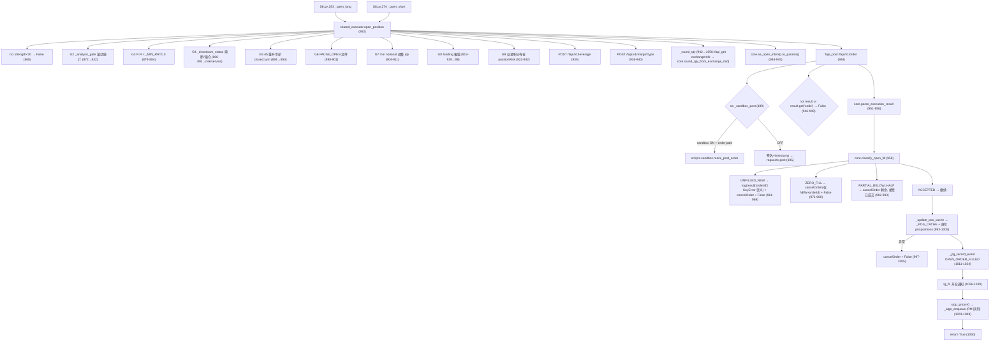
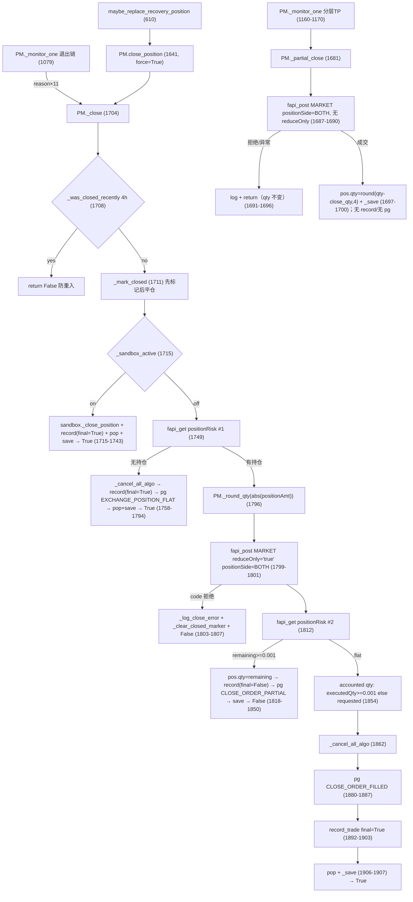

# Execution Service Inventory / Design（Phase 4-03-00 · READ-ONLY）

> 基于 feature/v2-architecture @ `cfac25c` 的实际代码逐行核实。
> 本阶段性质：**Inventory + Architecture Design**，不实现、不重构、不修复。
> 方法：READ → TRACE → CLASSIFY → DESIGN → DOCUMENT。
> 行号均为 `cfac25c` 当前代码实际行号（P4-02 后 shared_executor 行号已有位移，全部重新核对）。

基线：全量 775 passed；P4-01 Golden 60 tests；P4-02 Core/parity 125 tests。

---

## 1. Execution Responsibility Inventory

Category 取值：A=Decision，B=Risk，C=Execution Core（已提取），D=Execution Service（待提取/IO），
E=Position Manager，F=Persistence，G=Notification，H=Protection/Algo，I=Sandbox，J=Compatibility，K=Unknown。

### 1.1 strategies/shared_executor.py

| Function | Line | Current Responsibility | Category | Target |
|----------|------|------------------------|----------|--------|
| `open_position` | 862-1054 | 主开仓入口：12 道 gates + Binance 下单 + 成交解析/分类 + PM 注册 + PG + TG + Algo 入队 | A+B+D+E+F+G+H | **拆分**：gates 留 se（A/B），下单编排→`execution/service.py`（P4-03-01），副作用调用方留在 se compatibility |
| `open_position`（order params 段） | 941-945 | 经 `_exec_core.se_open_intent().to_params()` 构造 params | C+J | 已迁移（execution/core.py），保持 |
| `open_position`（parse/classify 段） | 951-993 | 经 `_exec_core.parse_execution_result` / `classify_open_fill` | C+J | 已迁移，保持（分支体语句在 se 逐字保留） |
| `fapi_get` | 172-185 | 自带签名 GET（timestamp+signature，异常→None）+ sandbox 拦截 | D+I | P4-03：作为 `BinancePort` 实现注入 service；函数本体保留 |
| `fapi_post` | 187-200 | 自带签名 POST（异常→None）+ sandbox 拦截 | D+I | 同上 |
| `_fapi_sig` | 167-170 | HMAC-SHA256 签名 | D | 保留在 se（BinancePort 实现的一部分） |
| `_sandbox_check` | 130-139 | 沙盘开关（env→全局缓存→标记文件） | I | 保留现址；service 经 port 消费 |
| `_sandbox_post` | 141-151 | order 路径拦截（谓词已迁移 core `is_order_path`）→ `scripts.sandbox.mock_post_order` | I+J | 保留现址 |
| `_sandbox_get` | 153-165 | positionRisk/account 查询拦截 | I | 保留现址 |
| `_round_qty` | 1056-1065 | exchangeInfo IO + core 纯核（`round_qty_from_exchange_info`） | D+C | IO 段→`execution/service.py`（SymbolMetaPort）；函数名保留为 compat |
| `_get_min_notional` | 106-127 | exchangeInfo MIN_NOTIONAL 查询（异常→5.0 吞掉） | D | P4-03：SymbolMetaPort 实现之一；兼容名保留 |
| `_get_funding_rate` | 98-104 | 资金费率查询（异常→0 吞掉） | D（供 A/B 消费） | 保留现址，作为 port 注入 |
| `_update_pos_cache` | 366-400 | PM 注册：写 `_POS_CACHE` + 直写 `pm:positions`（Redis） | E+F | **PM 边界**（Phase 7）；P4-03 仅抽象为 `PMRegisterPort` 注入点，实现不动 |
| `_refresh_positions` / `_get_positions` | 357-364 / 402-408 | `_POS_CACHE` 读写 | E | 保留（PM 状态读取） |
| `get_position_count` / `has_position` / `has_any_position` | 410-446 | 防重复开仓查询（PM 优先，positionRisk 兜底） | E（Decision 输入） | 保留；service 只经 port 读取 |
| `pm_monitor` | 448-481 | 分布式锁→`PM.monitor_all`→平仓列表→冷却写入 | E | 保留（PM 编排，Phase 7） |
| `reconcile_positions` | 350-352 | 空壳（PM 全权） | E | 保留 |
| `maybe_replace_recovery_position` | 590-619 | 恢复模式换仓：评分→`PM.close_position(force)` | B+E | 保留（Risk 恢复编排） |
| `_should_notify_close` | 484-512 | TG 平仓通知去重（Redis `notify:close`） | G | 保留（Notification） |
| `tg_send` / `_tg_pin` | 72-99 | Telegram HTTP | G | 保留（Notification adapter 复用） |
| `_pg_record_event`（re-export） | 17 | `postgres_client.record_trade_event` | F | 保留（Persistence adapter） |
| `_get_balance` / `_calc_used_margin` | 525-560 | account 查询（Risk Service IO 注入源） | B+D | 保留（已作为 risk/service 注入参数） |
| `_drawdown_status` / `drawdown_mode` / `calc_position_qty` | 572-585 / 671-680 | Risk Service wrapper（Phase 3-04） | B+J | 保留 |
| `_analysis_gate` / `_analysis_allows_open` / `_record_analysis_decision` / `_event_expected_move` | 699-770 / 832-848 | 历史分析过滤 gates | A | 保留（Decision） |
| `_was_closed_recently`（se 副本） | 850-860 | 4h 重开冷却（读 `closed:{sym}`） | A+E | 保留；**注意与 PM 同名实现并存**（见 Findings N5） |
| `load_state` / `save_state` | 328-347 | 策略状态持久化（Redis+文件降级） | F | 保留 |
| `get_market_state` / `market_allows_trading` / `get_short_ratio` / `event_is_stale` / `event_age_sec` | 1068-1083 / 637-657 / 622-634 | Decision 输入 | A | 保留 |
| `_log` | 202-209 | 日志（print+文件） | G（infra） | 保留 |
| `_algo_start_worker`（调用） | 355 | **import 副作用**：se 模块导入即启动 Algo worker 线程 | H | 见 Findings N1；保留 |
| `_algo_enqueue`（调用） | 1044-1046 | 开仓后 SL 入队（PM 实现） | H | P4-03：`AlgoPort` 注入点（实现仍 PM） |

### 1.2 shared/position_manager.py（PM — Phase 7 分解，P4-03 不动）

| Function | Line | Current Responsibility | Category | Target |
|----------|------|------------------------|----------|--------|
| `open_position` | 751-835 | 简化开仓（杠杆→保证金→MARKET→AlgoSL→`_save`）；**无生产调用方** | E+D | 保留现址（Phase 7 决定去留；见 Findings N4） |
| `_close` | 1704-1908 | 主平仓：防重入→标记→沙盘/实盘→查仓→市价平→剩余判定→record→pg→save | E+D | 保留现址（Phase 7）；P4-03 可提供独立 `close_market` 供未来替换 |
| `_partial_close` | 1681-1701 | 分层止盈（无 reduceOnly、无 record、负 qty 反转） | E+D | 保留现址（Phase 7） |
| `close_position` | 1641-1650 | 外部平仓入口（`_close(force=True)`） | E | 保留 |
| `_monitor_one` / `monitor_all` | 1079-1254 / 993-1078 | 退出链编排（费率→硬止损→紧急→早期亏损→停滞→be→分层TP→trail→峰值→1h反转→时间） | E+B | 保留（Phase 7） |
| `_ghost_cleanup` / `_ghost_cleanup_one` / `_try_record_ghost_trade` | 842-911 / 548-581 | 幽灵仓清理+记账 | E+F | 保留 |
| `reconcile_all` / `log_position_summary` | 1261-1334 | 对账 / 快照日志 | E | 保留 |
| `_merge_meta` / `_merge_meta_preserving_missing` / `_load` / `_load_meta` / `_save` | 604-720 | 三层持仓加载（WS→REST→meta）+ 保存 | E+F | 保留 |
| `_mark_closed` / `_was_closed_recently` / `_clear_closed_marker` | 1653-1678 | 平仓标记（Redis） | F+E | 保留 |
| `_algo_place_sl_inner` | 223-283 | Algo 条件单下单（exchangeInfo 舍入→cancel-all→POST algoOrder） | H+D | P4-03：AlgoPort 的**参考实现**；PM 内部调用不动 |
| `_algo_enqueue` / `_algo_start_worker` / `_algo_worker_loop` | 217-221 / 190-198 / 200-215 | 进程内 FIFO 队列 + 11s 限速线程 | H | 保留（P4-03 注入为 AlgoPort；队列线程属 infra） |
| `_algo_cancel` / `_cancel_all_algo` | 286-306 | 取消条件单 | H+D | 保留 |
| `_light_fapi_post/get/delete` | 72-156 | PM 自带轻量 Binance API（异常→None，**无沙盘拦截**） | D+I | 保留（见 Findings N3） |
| `_s6api` | 308-333 | 懒加载 8 元组 service locator（binance_api+market_data+trade_recorder，ImportError→light 兜底） | J+D | 保留（compatibility；见 Findings N2） |
| `_update_stop_loss` / `_place_trail_sl` / `_calc_trail_sl` / `_calc_trail_base` / `_calc_atr` / `_peak_pullback_check` | 1341-1634 | SL/TP 管理（be_done/trail/峰值保护） | H+E | 保留（Phase 7） |
| `_position_id` | 927-933 | 持仓稳定 ID（双格式族，PM OBS-1） | E | 保留 |
| `_get_funding_rate`（PM 副本） | 522-530 | 费率查询 | D | 保留（与 se 副本并存，N5） |
| `_notify_external_position` | 936-974 | 外部漏记仓告警（TG+PG） | G+F | 保留 |
| `_log_close_error` | 919-924 | 平仓错误限频日志 | G | 保留 |
| `_get_cfg` / `_is_tradable_symbol` | 738-744 / 598-601 | 配置/标的过滤 | E | 保留 |

### 1.3 shared/binance_api.py（BinancePort 现成实现之一）

| Function | Line | Current Responsibility | Category | Target |
|----------|------|------------------------|----------|--------|
| `fapi_get/fapi_post/fapi_delete` | 77-122 | 签名请求 + **异常上抛** + health 打点 + sandbox 拦截 | D+I | 保留现址；P4-03 作为 `BinancePort` 可选实现 |
| `_sandbox_intercept` | 54-72 | 拦截 positionRisk/account/openOrders/order+algo（含 cancel/delete 分流） | I | 保留（与 se/PM 拦截语义不同，N3） |
| `sign` / `load_config` / FAPI 常量 | 12-51 | 配置/签名 | D | 保留 |
| `fapi_get_public` | 125-132 | 公开行情 GET（无签名） | D | 保留 |

### 1.4 scripts/sandbox.py（沙盘服务）

| Function | Line | Current Responsibility | Category | Target |
|----------|------|------------------------|----------|--------|
| `is_active` / `_load_state` / `_save_state` | 37-61 | 开关+JSON 状态文件 | I | 保留现址 |
| `mock_post_order` / `mock_cancel_order` / `mock_get_position_risk` / `mock_get_account` / `mock_get_open_orders` | 101-230 | 模拟订单/查询响应 | I | 保留 |
| `_get_current_price` / `seed_price` | 77-91 / 72-74 | 真实行情+喂价 | I | 保留 |
| `check_positions` / `_close_position` | ~260-340 | 沙盘自动止损/平仓（PM._close 沙盘路径调用 `_close_position`） | I | 保留 |

### 1.5 execution/core.py（P4-02 已提取 — Category C 基准）

`order_side_for` / `close_order_side_for` / `OrderIntent`（se_open/pm_open/close/partial_close_intent）/
`is_rejected` / `parse_execution_result` / `ExecutionResult` / `OpenFillOutcome` / `classify_open_fill` /
`round_qty_by_lot_step` / `round_qty_from_exchange_info` / `round_qty_by_precision` /
`remaining_after_partial` / `partial_pnl_u` / `position_pnl` / `REMAINING_EPS` /
`has_remaining_position` / `accounted_close_qty` / `is_order_path` — 全部 stdlib only，已由 125 tests 冻结。

---

## 2. Current Open Execution Flow（重新核实，行号为 cfac25c 实际行号）



事实核对说明（与 P4-00 文档差异处，以本表为准）：
- `open_position` **不取消 stale algo SL**（cancel 仅发生在错误/部分成交分支的 `cancelOrder` 与 Algo worker 的 `_cancel_all_algo` 前置）；
- order 失败**无 retry**（单次尝试，P4-01 E-OBS-1a 已冻结）；
- 全局 `_algo_start_worker()` 在 se **模块导入时**执行（L355）。

---

## 3. Current Close / Partial Execution Flow（重新核实）



与 P4-00 文档差异（以本表为准）：full-close 分支顺序为 **pg → record**（L1880→L1892），
flat 分支为 **record → pg**（L1773→L1785）——两分支 record/pg 顺序相反（E-OBS-6a 已冻结，不修复）。

---

## 4. IO Port 依赖图（P4-03 Execution Service 需要注入的边界）

```
                    ┌────────────────────────────┐
                    │      execution/service      │
                    │  (P4-03-01 起，纯编排+端口)  │
                    └──────┬──────────┬──────────┘
        BinancePort        │          │ SymbolMetaPort
  (post/get/delete；       │          │ (exchangeInfo: LOT_SIZE/
   se.fapi_* 或            │          │  MIN_NOTIONAL; funding;
   binance_api.fapi_*)     │          │  price — 按 open/close 路径选择)
                           │          │
        SandboxPolicy ─────┤          ├────── AlgoPort
  (check/post/get 拦截，    │          │ (enqueue；worker 线程留 infra)
   现址保留，经函数注入)     │          │
                           │          │
        PMRegisterPort ────┤          ├────── ObserverPorts
  (_update_pos_cache；     │          │ (PG: pg_record_event)
   Phase 7 前实现不动)      │          │ (TG: tg_fn — 由调用方传入)
                           │          │ (Log: log_fn)
                    ┌──────┴──────────┴──────────┐
                    │        execution/core       │
                    │   纯逻辑（P4-02 已完成）      │
                    └─────────────────────────────┘
```

关键设计约束（来自 Golden 行为，禁止改变）：
1. **BinancePort 按路径选择实现**：open 路径必须用 `se.fapi_post`（异常→None 语义 + se 沙盘拦截）；
   PM 路径（Phase 7 前）继续用 `_s6api()`（binance_api 上抛 / light→None 二义性，N2）。**不得混用**，否则异常语义改变。
2. **Sandbox 拦截保持在现有实现内**：service 不自行实现拦截；把 `se.fapi_post/fapi_get` 直接作为 port，
   拦截逻辑（se._sandbox_post/_sandbox_get）原样生效 → 沙盘行为零变化（E-OBS-11a 冻结）。
3. **副作用不出 service**：PG/TG/Algo/PM 注册由 service 的**返回值**驱动，调用方（se）保持现有
   顺序调用（E-OBS-2 / E-OBS-6a 顺序冻结）。service 只做"下单+解析+分类+确认"。
4. **PM 注册与 closed 标记不入 service**（PM 边界，Phase 7）。

---

## 5. Execution Service Design（P4-03-01+ 实施蓝图，本阶段仅设计）

### 5.1 文件布局（允许新增）

```text
execution/
    core.py        (P4-02，不再扩)
    service.py     (P4-03-01 新增：ExecutionService + 端口协议)
```

禁止：`execution/binance.py`、`execution/pm.py`、`execution/observers.py` 等新文件；
适配器直接复用现有函数（se.fapi_*、binance_api.fapi_*、PM._algo_enqueue），以函数引用注入。

### 5.2 端口协议（Protocol，structual typing，不引第三方）

```python
class BinancePort(Protocol):
    def post(self, path: str, params: dict) -> dict | None: ...
    def get(self, path: str, params: dict | None = None) -> dict | list | None: ...

class SymbolMetaPort(Protocol):
    def round_qty(self, symbol: str, qty: float) -> float: ...     # = se._round_qty
    def min_notional(self, symbol: str) -> float: ...               # = se._get_min_notional
    def funding_rate(self, symbol: str) -> float: ...               # = se._get_funding_rate

class AlgoPort(Protocol):
    def enqueue(self, symbol: str, side: str, trigger: float, qty: float) -> None: ...
```

### 5.3 Service 函数（对齐现有行为，返回值驱动副作用）

| 函数 | 输入 | 行为（=现编排的纯 IO 段） | 返回 |
|------|------|--------------------------|------|
| `open_market(...)` | symbol/side/qty/leverage/margin_mode + ports | leverage POST → marginType POST → round_qty → `se_open_intent` → order POST → `parse_execution_result` → `classify_open_fill` → 取消分支（cancelOrder POST） | `OpenOutcome(order_params, raw_result, parsed, outcome, cancelled: bool)` |
| `close_market(...)` | symbol/side/qty + BinancePort | positionRisk 确认 → `close_intent` → order → positionRisk #2 → `has_remaining_position` / `accounted_close_qty` | `CloseOutcome(flat_before, order_result, remaining_qty, accounted_qty)` |
| `partial_close_market(...)` | symbol/side/close_qty + BinancePort | `partial_close_intent` → order（无 reduceOnly） | `PartialOutcome(rejected: bool, raw)` |
| `place_algo_sl(...)` | symbol/side/trigger/qty + BinancePort | exchangeInfo 舍入（纯核在 core）→ cancel-all → algoOrder POST | raw dict / `{'error': ...}`（沿用 PM 语义） |
| `exchange_position_qty(...)` | symbol + BinancePort | positionRisk 单币查询（方向过滤谓词可后续入 core） | list/dict|None |

**编排守恒**：`open_market` 的返回值被 se 现有代码消费，
`_update_pos_cache → PG → TG → algo` 的调用顺序、异常语义（含 MARKET 未成交 log 的
`result["orderId"]` KeyError 路径）、返回值 True/False 全部留在 se，逐字不变。

### 5.4 P4-03 分步实施（每步跑全量守恒）

| Step | 内容 | 状态 |
|------|------|------|
| 01-A | 骨架：`execution/service.py`（`ExecutionService.execute_order(intent)` 最小 API）+ `execution/ports/binance.py`（`BinancePort`，仅 `place_order`）+ `execution/adapters/binance.py`（`SharedExecutorBinanceAdapter`，se.fapi_post 以 callable 注入，不 import strategies）；40 个 contract/characterization tests。**se/PM 零修改** | ✅ 本阶段 |
| 01-B | `open_market` 编排：se.open_position 的 EXEC 段（935-993）改为经 service（语句级等价改写），`_update_pos_cache → PG → TG → algo` 留在调用方 | ✅ 本阶段（最小接线版） |

> P4-03-01-B 实施记录（03802e3 之后）：
> - **未建** `open_market`（避免提前编排）：采用最小接线——se 新增 `_execution_service()`
>   工厂（每次调用以**当前模块级 fapi_post** 晚绑定构建 adapter，保留 monkeypatch/sandbox/
>   异常→None 语义，无全局状态）；open_position 的订单提交 3 行改为
>   `intent → execute_order → outcome.raw`，rejection 检查/解析/分类/分支体/PM/PG/TG/Algo
>   逐字不动
> - 13 个集成测试（`test_open_service_integration.py`）冻结：路由经 service、intent 与
>   core 生成一致、SE 参数（RESULT/无 positionSide/reduceOnly）、成功续走 PM/PG/TG/Algo、
>   拒绝/None/异常失败、PM 失败 cancel、G9 先于 service 且 service 后无新增 duplicate
>   check、fill 60%/30% 分类

> P4-03-01-C 实施记录（5a68ce2 之后）：
> - **PM 最小接线（依据 §20-27 允许条件）**：close/partial 的 Binance 订单提交只存在于
>   `PM._close`（L1799）/ `PM._partial_close`（L1687），无其他边界可接入 service——
>   因此修改 PM 两处提交行（各 1 处）+ 新增 `PM._execution_service()` 工厂
>   （晚绑定 `_s6api()` 的 fapi_post：保留双实现错误语义 N2 / 沙盘前置判断 / 异常原样）。
>   orchestration（marker-first、沙盘门、positionRisk×2、remaining 判定、record/pg/save
>   顺序）**零改动**
> - intent 复用 core：`close_intent`（SHORT→BUY，BOTH，reduceOnly='true'）/
>   `partial_close_intent`（无 reduceOnly，E-OBS-5）；close_qty 原样传递（负数不 clamp，
>   E-OBS-7）
> - 18 个集成测试（`test_close_service_integration.py`）：20 项要求全覆盖
>   （路由/intent 相等/LONG→SELL/SHORT→BUY/参数逐字/负 qty 原样/异常/拒绝/already-flat
>   port 零调用/PM 后续流程/含 port 事件的全时序冻结）
> - se 零改动；PM.open_position（legacy，无生产调用方）未迁移（E-OBS-9 保持）
| 02 | `close_market` / `partial_close_market` 设计对齐（**不改 PM**；先以 parity 测试锁定 service vs PM 行为） | ✅ 以 01-C 最小接线形式完成（见下注） |
| 03 | `place_algo_sl` service 化（PM 的 `_algo_place_sl_inner` 保持现址；service 版本供 open 路径复用或 Phase 7） | 待做 |
| 04 | SymbolMetaPort 收口：`_round_qty/_get_min_notional/_get_funding_rate` 保留 compat 名，内部走 service | 待做 |

> P4-03-01-A 实施记录（2eeebab 之后）：
> - 新增 `execution/service.py` / `execution/ports/binance.py` / `execution/adapters/binance.py`
> - `OrderExecution` 结果模型：`intent`（原对象）/ `raw`（原样响应）/ `rejected`
>   （core.is_rejected 原始 truthy 值，N7）；成交解析（需 entry_price）留给 orchestration
> - Port 仅 `place_order`（不为未来预建方法）；Adapter 不做 try/except，
>   异常/None 语义 = 注入 callable 原样（se 路径 → None，无 retry）
> - sandbox 未接入 service（拦截留在 se.fapi_post 内，注入后自动生效，E-OBS-11a）

---

## 6. Risks / Findings（全部为 Golden Behavior，只记录，不修复）

### 6.1 继承自 P4-00（E-1~E-10）与 P4-01（E-OBS-1~12）——仍然有效，摘要见原文档

重点提示：E-1 重复 open、E-2 Binance 成功后 PM 失败→cancel、E-3 Algo SL 异步无止损窗口、
E-4 先标记后平仓、E-5/E-9 partial 无防重入、E-6 flat 路径不清 Algo SL、E-10 沙盘拦截不一致；
E-OBS-5 partial 无 reduceOnly、E-OBS-7 负 qty 反转、E-OBS-8 partial 无 record、
E-OBS-11a 拦截仅按 path 含 'order'。

### 6.2 本阶段新发现（N 系列）

| # | 发现 | 证据（cfac25c） | 影响 |
|---|------|----------------|------|
| N1 | `se` 模块导入即执行 `_algo_start_worker()`（L355）——import 副作用启动守护线程 | strategies/shared_executor.py:355 | 测试外的隐式线程；任何 import se 的进程都会起 worker |
| N2 | `_s6api()` 双实现错误语义二义：binance_api.fapi_* **异常上抛**，`_light_fapi_*` **返回 None**；同一调用点行为取决于 s6_auto_trader/market_data import 是否成功 | PM L308-333 vs binance_api L84-106 vs light L72-156 | PM._close 的 except 分支在两种模式下触发频率不同；P4-03 端口必须按路径固定实现 |
| N3 | 沙盘拦截三套语义：binance_api 拦 `order|algo`（含 cancel/delete 分流，L54-72）；se 拦 path 含 'order'（无 delete 分流）；PM `_light_fapi_*` **完全不拦**（PM 靠 `_sandbox_active()` 布尔前置兜底） | binance_api L66-69 / se L141-151 / PM L72-156 | 同一下单在沙盘下可被拦 0/1/2 次；PM 的 Algo SL 在沙盘下可能真实下单（P4-00 §8 已记，本阶段确认仍成立） |
| N4 | `PM.open_position`（L751）无生产调用方（S6/S8 走 se），与 se 版本构成双 open 实现 | grep 全仓 | Phase 7 去留决策；其 AlgoSL 在订单后、PM 注册前（与 se 相反顺序） |
| N5 | 同名/同职责函数多副本：`_round_qty`（se/PM 双舍入制，E-OBS-10）、`_get_funding_rate`（se L98/PM L522）、`_was_closed_recently`（se L850/PM L1661） | grep | 三处副本语义有差（如 PM 版 `_was_closed_recently` 用于防重入，se 版用于重开冷却）；P4-03 只收口 open 路径用到的，副本保留 |
| N6 | `pm:positions` 双写方：se `_update_pos_cache` 直写（L395-397）与 PM `_save`（L715-720）；且 se 写入失败静默（L398-399 try/except pass） | L394-399 | 与 E-2 相关：静默失败→幽灵仓链路 |
| N7 | `is_rejected` 冻结为原始 truthy 值（`{}`→True、code 原值、code=0→falsy），se 内仍用原表达式（P4-02 接线点 4 未动 rejection 判断） | se L946-949 / core `is_rejected` | 语义已由 parity 测试锁定；service 内统一走 core 时必须保持同一短路语义 |
| N8 | full-close 与 flat 分支 record/pg 顺序相反（pg→record vs record→pg） | PM L1880/1892 vs L1773/1785 | E-OBS-6a 已冻结；service.close_market 的返回值设计不得隐含"统一顺序" |
| N9 | `UNFILLED_NEW` 分支 log 使用 `result["orderId"]` 直接索引 → 无 orderId 时 KeyError → 外层 try 吞掉返回 False（无 cancelOrder） | se L963-969 | 已由 P4-01 `test_zero_fill_no_order_id` 冻结；service 化时 log 语句必须逐字保留 |
| N10 | `se.open_position` 的 TG/Algo 段在 PG 之后、且 Algo 入队失败仅 log（L1041-1048 try/except） | L1041-1048 | 开仓成功但 SL 队列入队失败 → 仓位无 Algo SL（叠加 E-3 的 11s 窗口） |

### 6.3 明确不做（P4-03-00 边界）

- 不实现 service、不建 adapters 文件、不动 PM/PM 队列线程、不统一 Binance API 四套实现、
  不修 N1-N10、不动 retry（不存在）、不动 sandbox、不改 close 顺序、不改 Redis/PG schema。

---

## 7. 验收对照（本阶段）

- [x] 全部必读文件已实际阅读（se 1084 行全文、PM 1940 行相关段、binance_api 132 行、
      execution/core.py、sandbox.py、5 个测试文件、3 份 docs）
- [x] 全部 grep 依赖搜索已执行（结果已体现在分类表/流程图/Findings）
- [x] Production code 零改动（git diff 仅本文件）
- [x] Golden behaviors 全部保持 OBSERVED 状态
- [x] Open/Close 调用链从当前代码重新核实（非沿用 P4-00）

> P4-03-01-D2 实施记录（617f2b3 之后）：
> - `execution/ports/position_state.py`：`PositionStatePort`（load_positions /
>   save_positions，契约 = `PM._load_meta`/`PM._save` 行为逐字镜像）
> - `execution/adapters/position_state.py`：`RedisPositionStateAdapter`
>   （注入式 redis_get/redis_set；key 'pm:positions' 逐字冻结；异常镜像；
>   无 TTL；不创建 client）
> - **pilot wiring：仅 `PM._save`**（写路径）——9 条安全条件可证 + 24 个
>   测试（contract/parity/异常语义/pilot 冻结/依赖隔离）；`_load_meta` 与
>   `se._update_pos_cache` 未接（有 No-wiring 冻结测试）
> - `REDIS_BOUNDARY_INVENTORY.md`：全量 key 分类 A-G、真值模型
>   （exchange=真相 / pm:positions=本地元数据层+_POS_CACHE=进程缓存）、
>   boundary 范围单 key；新观察 PMB-4/5
> P4-03-01-D3 实施记录（faf95f6 之后）：
> - `execution/ports/ledger.py`：`PositionLedgerPort`（两个 seam 逐字镜像：
>   record_trade_event / upsert_trade_episode；不发明业务接口）
> - `execution/adapters/postgres_ledger.py`：`PostgresLedgerAdapter`
>   （callable 注入；不上抛/包装异常；transaction 语义全属 helper）
> - **NO-WIRING**（§九条件全命中：写入分散 7 处、trade_recorder 强耦合、
>   吞错 fire-and-forget）；no-wiring 状态有测试冻结
> - `LEDGER_BOUNDARY_INVENTORY.md`：十问十答、A-E 分类、Open/Partial/Full
>   Close 真实写入链、PnL producer/persistence/consumer 盘点；新观察 PMB-6/7
> P4-03-01-D4 实施记录（1636a6e 之后）：
> - `execution/ports/protection.py`：`ProtectionPort`（5 个真实 seam 逐字镜像：
>   enqueue/start_worker/place/cancel_id/cancel_all；无线程所有权）
> - `execution/ports/notification.py`：`NotificationPort`（notify_external_position /
>   log_close_error，含状态机原样冻结）
> - `execution/adapters/protection.py` / `notification.py`：注入式零逻辑委托
> - **NO-WIRING**（seam 各带业务/状态，塞入 adapter 即复制业务判断）
> - `PROTECTION_MONITORING_INVENTORY.md`：A-F 分类 + Algo SL 完整链
>   （11s 窗口/无 retry/先 cancel 后下单）+ 监控/幽灵/协调查分；新观察 PMB-8/9