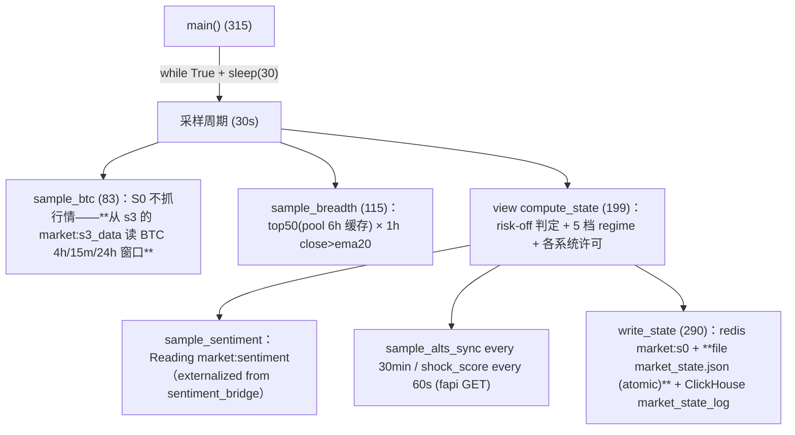

# S0 Inventory（Phase 6-00 · READ-ONLY）

> 基于 feature/v2-architecture @ `54deb21`，`services/s0/s0_market_guard.py`（337 行）
> + `services/s0/s0_reader.py` 逐行核实。Production code 0 change，只审计。

---

## 1. 真实入口与调用链

S0 = **独立进程**（`python services/s0/s0_market_guard.py` → `main()`），无模块 import 它。



- 写频率：**60s**（`last_write` 节流；采样 30s 一次但 only >=60s 时 write_state）
- 多进程/线程：无（单 loop、无 WS）；外层 try/except 吞错（330-331 log+continues）
- 重启：state 进程零驻留（每周期全量重算；`_breadth_symbols_cache` 冷启动重建）

## 2. IO 分类（纯计算 vs IO）

| 类别 | 函数 | 事实 |
|------|------|------|
| **A. Pure feature** | `compute_state`（除 sentiment/冲击注入外）、`sample_btc` 的判定式、`sample_breadth` 的 ratio 算式、`_s3_win` | 只依赖调用方传入/读取的数据快照 |
| **B. Pure classifier** | `compute_state` 主体（risk_off/5档 regime/各系统 permit） | 数学纯（受 `time.time()%1800/%60` 副参数影响，见时间语义） |
| C. Stateful | `get_breadth_symbols`（6h pool 缓存） | 进程内存 |
| D. IO | `fapi_get`（requests + raise_for_status——**S0 自带 API 客户端**，与 shared.binance_api 平行）、`_rget`(market:s3_data/market:sentiment)、`_rset`(market:s0)、`STATE_FILE` 文件原子写、ClickHouse insert | — |
| E. Orchestration | `main`（fetch→sample→compute→write→60s 节拍） | God loop（仅 22 行，但输入多） |

引用关系：**S0 依赖 S3**（btc/breadth/alts 全部读 `market:s3_data`——单向读消费）。

## 3. 输入清单（真实代码）

| 输入 | 来源/键 | 缺失行为 | 单位/类型 |
|------|---------|----------|-----------|
| BTC ema20/ema60/close(4h)、volatility(15m/24h)、high/low(15m) | `market:s3_data` ← **S3** | `_s3_win` 默认 0 | float |
| breadth numerator `close > ema20 > 0`（strict） | S3 1h 窗口×50 symbols | ema20≤0 → 不计上；**total 仍 +1** | bool |
| alts sync (10 alt) chg | S3 | chg==0 → skip（total 不计入）；BTC chg==0 → (0.5,0,0) | ratio |
| sentiment（fng/avg_funding/sentiment_risk/bias） | `market:sentiment`（sentiment_bridge 写） | {} 默认 | dict |
| ticker/24hr | Binance REST（shock score + breadth pool 共用） | except → score 保持 | list |
| universe pool | 6h 缓存 top50 by quoteVolume（排除 BTC+stables） | fetch 失败 → 沿用旧列表 | list |

**硬编码阈值**（全部模块级常量，无配置通道）：
`BREADTH_N=50`、pool TTL 6h、`EXCLUDE={BTCUSDT,USDCUSDT,BUSDUSDT,TUSDUSDT,USDTUSDT,FDUSDUSDT}`、
bull/bear 判定（ema20>ema60 且 price>ema20 / 全部反置 + price<ema20）、
`amp<0.015 low / <0.03 normal / else high`、`atr_expanding = vol_15m > vol_24h*1.3`、
breadth strong>0.7 / normal>0.4 / weak<=0.4、risk_off 条件（见 decision table）、
regime 分档（bull_trend/weak_bull/weak_bear/r range/risk_off + score -7..+7 + trend_strength）、
fapi timeout 10、write 节流 60s、30s mod 采样门 `int(ts)%60<30` / `%1800<30`。

## 4. Breadth 算法（10.9% 的来源——回答 §八）

```text
total   = min(len(top50_fast_list), len(pool))   # get_breadth_symbols() 总量
above   = Σ [sym: s3_data[sym].1h.close > ema20 > 0]
ratio = above / total（total=0 → 0.5 default！）
```

- **denominator**：6h 缓存的 top50 顺序池——total 就是「探到的 top N」数量；
- **numerator**：仅当该币在 **S3 的 market:s3_data**（`sym in symbols_data` 路径分支，124 行）存在
  且 1h 窗口的 close/ema20 满足 strict 关系；
- **close==0/ema20==0（S3 数据缺失）→ 计入 total、不算 above**！
  （ breadth 低估导致 race——10.9% 即 S3 数据部分缺失时的实际产物）；
- 计算 `0.7/0.4` 仅为三档命名（strong/normal/weak），**risk_off 直接用 ratio<0.30**，
  与档名解耦（保守对照：weak 边界 0.40 与 risk-off 边界 0.30/0.35 双阈值并存。

## 5. Regime / Output Inventory（decision table，真实代码提取）

| market_state | regime | regime_score | trend_strength | 触发 |
|--------------|--------|--------------|----------------|------|
| risk-off | risk-off | -7 | 0 | `(btc<ema60 AND atr_expanding) OR amp>0.04 OR breadth<0.30` |
| trend | bull_trend | 5 | 85 | btc bull + breadth strong |
| range | weak_bull | 3 | 65 | btc bull 且 breadth!=weak |
| range | weak_bear | -3 | 25 | btc bear **或** breadth<0.35 |
| range | range | 0 | 50 | 其余 |

permit: `s6_allowed = not risk_off or btc bull`；`s7_allowed = regime in (range, weak_bull)`；
`s8_allowed = not risk_off AND regime != bull_trend`。
sentiment：`regime_score = max(-7, score-1)`（仅收紧到 -7 地板）。
alts_sync 每 30min（`%1800<30`）/shock 每 60s（`%60<30`）**按墙钟取模**——同周期一半
时间的输出字段是 0（事实）。

**Risk-off 分级事实**：**无 SOFT/HARD 分级**——单布尔 risk_off + 5 档 regime
（历史认知 "breadth 弱+bear=HARD" **不再成立**——现在只有 ratio<0.30 一条线 +
verdict 叠加）。

## 6. Redis 契约

| key | 动作 | 语义 |
|-----|------|------|
| `market:s0` | write_state 全量覆盖（60s 节拍） | latest state slot（非队列）；JSON 字典 20+ 字段；**无 TTL** |
| `services/s0/market_state.json` | 原子文件双写（tmp+rename） | — |
| ClickHouse `default.market_state_log` | 每写一次 insert（事件历史） | CH 失败仅 log |
| `market:s3_data`（R） | _s3_window 读取 | S0←S3 唯一依赖 |
| `market:sentiment`（R） | sentiment_bridge 生产 → S0 消费 | fail→空 dict |

无 publish——消费方靠 30s 写节拍自己拉。

## 7. Consumers（含 fail-open/fail-closed 判定）

| 消费方 | 读取 | fail 行为 |
|--------|------|-----------|
| se.get_market_state / market_allows_trading | **读 `market_mode` 键** | ⚠ S0-1：S0 写的是 `market_state`——键名不一致 → **market gate 恒 PASS（fail-open）**；stale 无 gate（redis helper 文件降级兜底） |
| s0_reader.load_market_state（S7 主路径） | version ≥1.0、age ≤180s | stale/version 缺 → None → fallback_fn/"range" |
| s0_reader.get_regime/get_btc_trend/get_breadth*/shock/risk_off | 各字段+fallback 默认 | missing → fallback（range/0/0.5/50/False） |
| `is_system_allowed` | `s6_allowed` 等 | missing → **True（fail-open 保守默认=True，注释自称"保守"——实为放开）** |
| shared/market_data | breadth/btc_trend 加分逻辑、(market_state,trend_strength) | except → 默认 'range'/50 |
| trade_recorder / s6_auto_trader | market_state 字段（分析上下文） | missing → 空 |
| S6.py journal | `_ms.get('regime')_` 落 jb（仅记账） | missing → None |

**fail-open 总评**：S3 数据缺失 → breadth 被动稀释但不报错；S0 死 → s0_reader 180s
stale 触发各 fallback（默认"range"）；se 的 market gate 名实不符（S0-1）。

## 8. 状态机 / 时间语义

- **S0 是无状态分类器**（stateless classifier）——没有 previous-regime 比较、hysteresis、
  transition suppression、cooldown；每个周期由当前输入独立重算（task 10 的答案）。
- time：`int(time.time())` 写入 timestamp；写节流 60s；**无 stale check 在 producer**，
  消费方各自判断（180s）。
- alts/shock 受 wall-clock mod 控制——周期时刻决定字段是否填充（事实）。

## 9. Multi-instance

无 leader lock、无 publish——两个实例 = last-writer-wins（Redis + 文件）+
ClickHouse 双行（market_state_log 事件历史被双写）。

## 10. Failure Matrix

| Failure | 行为 |
|---------|------|
| ticker/24hr 失败（breadth pool） | warning → 沿用旧列表（可能空 → breadth 默认 0.5） |
| market:s3_data 读失败 | symbols_data={} → breadth 全 0.5 / alts (0.5,0,0) / BTC neutral |
| ticker 24hr（shock）失败 | exception 吞 → score=0 |
| market:sentiment 失败 | {} → sentiment_risk False（fail-open） |
| Redis 写失败 | 吞（`except: pass`）；文件+CH 照写 |
| 文件/CH 失败 | 文件无 except（**异常上抛→外层 catch→log**）；CH warning |
| sample 系抛错 | main 外层 catch，log error，30s 继续 |
| 空 universe | total=0 → breadth_ratio=0.5（**default normal，不是 weak**） |
| 缺 BTC 窗口 | ema/close/vol 全 0 → neutral/amp 0/非 atr 展开 |
| classify 异常 | 之上层 catch（compute_state 内部无 dtype 强护——浮点型化兜底） |
| S0 JSON version 老键 | s0_reader version gate → fallback_fn/range |

## 11. God Function

`compute_state`：~90 行（regime 5 档 + permit + sentiment 叠加 + alts/shock 时刻门），
input=7、写入 state dict 22 项。`main` 是 22 行编排 loop（薄），`sample_*` 三兄弟
sample IO 与 feature 混合度低。

## 12. Pure/Stateful/IO 分类表（P6 拆分输入）

| A Pure feature | B Pure classifier | C Stateful | D IO | E Orchestration |
|----------------|--------------------|------------|------|------------------|
| _s3_window/_s3_win、sample_btc 判定式计算、sample_breadth 计数、sample_alts_sync 计数、sample_shock_score 计算（除 fapi） | compute_state 主体 | get_breadth_symbols 6h 缓存（唯一真正的 state） | fapi_get、_rget/_rset、文件、CH、main/sleep | main、sample_* 包装 |

## 13. Decision Table（真实代码 fidelity）

| btc<ema60 | atr expanding | amp | breadth_ratio | btc trend | breadth | → market_state / regime | permit |
|-----------|----------------|-----|---------------|-----------|---------|--------------------------|--------|
| T | T | any | any | any | any | risk-off / risk-off (-7/0) | s6 N/F, s7 N, s8 N |
| F | - | >0.04 | any | any | any | risk-off / risk-off | 同上 |
| F | - | ≤0.04 | <0.30 | any | any | risk-off / risk-off | 同上 |
| F | - | ≤0.04 | ≥0.30 | bull | strong | trend / bull_trend (5/85) | s6 Y, s7 N, s8 N |
| F | - | ≤0.04 | ≥0.40 | bull | normal | range / weak_bull (3/65) | s6 Y, s7 Y, s8 Y |
| F | - | ≤0.04 | 0.30..0.35 且 bull | bull | normal | range / **weak_bull 与 weak_bear 冲突区（regime 先判 bull 分支，落 weak_bull；但是 risk_off 上限 0.30 → 0.30≤ratio<0.35 时 weak_bear 分支不达？trigger 是 ratio<0.35 定义 bull+not-weak → weak_bull；而 ratio<0.30 已被 risk_off 吞——真实区间冲突见 §14）** | — |
| F | - | ≤0.04 | ≥0.35 | bear | any | range / weak_bear (-3/25) | — |
| F | - | ≤0.04 | ≥0.30..0.40 | neutral | normal | range / range | — |

**矛盾信号并非去重**——bull 趋势 + breadth_ratio 0.32 时：
risk_off False、bull_trend 条件不满足（breadth!=strong）、`btc bull and breadth!=weak`
== True → **weak_bull**（即 breadth 极弱但未破 0.30 → 仍允许 weak_bull——潜在规则
间不对齐，OBSERVED）。

## 14. 与 Risk 的边界（避免误拆）

S0 输出=market context（regime/score/permit）——**不含**仓位 sizing/leverage/SL
（这些属 risk/service）。当前 S6 LOW_SIGNALS 的 STOP_LOSS_PCT 表直接把
VIOLENT_BULLISH→0.08 写在策略常量——与 S0 无关（记录边界事实）。

## 15. Priority 危险行为清单（S0-1..）

- **S0-1：`market_allows_trading` 读 `market_mode`，S0 写 `market_state` →
  risk-off 门在 S6/S8 主链上不启用（fail-open by key-mismatch）**
- S0-2：`is_system_allowed` 缺键默认 True（"保守默认"注释与实际相反）
- S0-3：alts_sync/shock_score 按墙钟 mod 决定字段值（一半周期=0 冲刺值），下游把
  0 当数据处理（无 freshness 标记）
- S0-4：`empty universe → breadth 0.5` 折叠为 "normal"（中性缺省，不是保守空头）
- S0-5：S0 写 `market_state`，S7/s0_reader 读 `market_state` ✓；**仅 se 错读
  `market_mode`**（S0-1 实为 shared_executor 副本消费明差点）
- S0-6：sample pool 6h 缓存跨 update（dc universe drift no_annotations）
- S0-7：restart → 全量重算，无 previous regime（无状态机的事实证据）
- S0-8：多实例 last-writer-wins + CH 双写

全部 OBSERVED，不修。

## 16. Decomposition Proposal（Phase 6 实现蓝图）

真实 seam 明确（compute_state 已是纯分类器、main 薄）——建议：

```text
S0 IO Adapter   （fapi_get + market:s3_data/sentiment reader + redis/file/CH writer）
    ↓ MarketSnapshot（BTC + breadth pool + sentiment）
s0.state.py     ← （可选：pool 缓存注入）
    ↓
Regime Classifier（compute_state 分离成：classify(btc_trend, vol, amp,
                 breadth...) -> regime + risk_off + permits，纯函数）
    ↓
s0.publisher    ← redis+file+CH 三路写入（端口注入式）
```

**优先抽取：Regime Classifier（B 类），保持 compute_state 兼容 seam。**

## 17. 建议子阶段

| 子阶段 | 内容 |
|--------|------|
| P6-01 | S0 golden characterization（breadth 三点/0.30/0.35/0.70 边界、bull/bear/neutral、risk_off 三条件、permit 表、S0-1 fail-open 事实冻结） |
| P6-02 | Regime Classifier 抽取（s0/core.py，纯；compute_state 主体委托） |
| P6-03 | Publisher（Redis+file+CH 三写 port，与 Phase 4/D2/D3 同注入式风格） |
| P6-04 | MarketSnapshot/输入 port（_s3_window reader + breadth pool StatePort） |
| P6-05 | Integration closure（S6/S8/s0_reader/sentiment 消费对拍 + fail-open 事实索引） |

优先级注释：P6-02/03 可合并（classifier 与 publisher 分属两 seam 且互不纠缠）；
**S6/S8 消费端（market_mode 名实不符）P6-01 冻结、修复属 P7 行为变更。**
