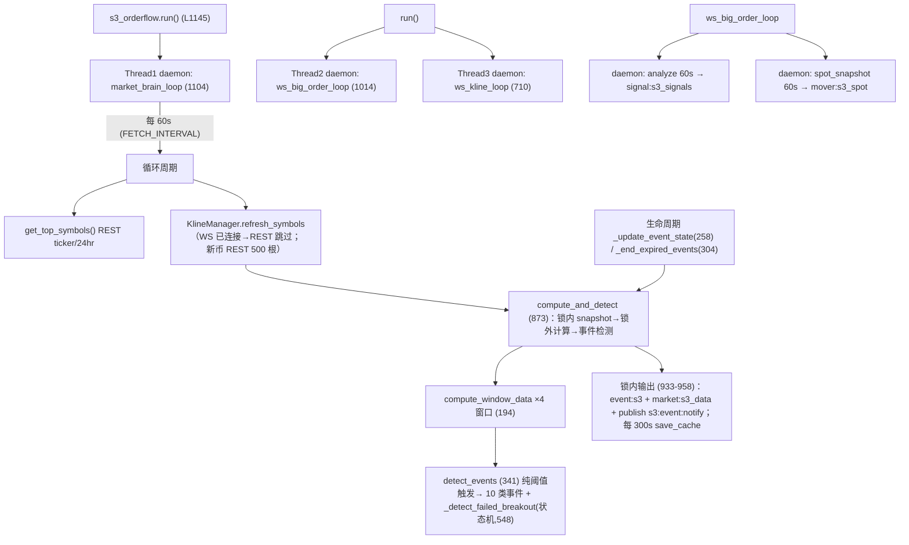

# S3 Inventory（Phase 5-00 · READ-ONLY）

> 基于 feature/v2-architecture @ `147477b`，`strategies/s3_orderflow.py`（1174 行）逐行核实。
> Production code 0 change。只审计，不拆，不修。

---

## 1. 入口与调用链（真实结构）

S3 是**独立进程**（`python strategies/s3_orderflow.py` → `run():1174`），仓库内**无任何模块 import 它**。



- **频率**：60s 主循环；WS 事件驱动；大单/现货 mover 60s节拍
- async：无（7 个 daemon 线程 coexists：market_brain / big-order WS / kline WS / analyze / spot_snapshot）
- 顶部整循环 try/except 外层吞错（1132-1135 log+continues）；WS 消息解析静默吞（690/1008）

## 2. IO 边界分类（P5 核心分型）

| 类别 | 函数 | 举证 |
|------|------|------|
| **A. Pure candidate** | `detect_events`(341, 除 FAILED_BREAKOUT 外的主链)、`compute_window_data`(194)、`compute_atr`(182)、`compute_rsi`(166) | 仅依赖入参（candles/windows），无 IO、无模块态 |
| B. Stateful decision | `compute_ema`(133，**增量路径读 `_ema_cache`**，且 `values[0]` 为窗口内最旧值 —— S3-1 冻结观察)、`_update_event_state`(258，`_event_states` 冷却+去重)、`_end_expired_events`(304)、`_detect_failed_breakout`(548，`_fb_state` 状态机) |
| C. IO | `_api_get`(80，requests+429 递归重试+全局限速)、`fetch_klines`(110)、`get_top_symbols`(101)、`_get_spot_momentum`(971)、KlineManager load/save(Redis+文件降级)、`_rset/_rpublish` 全部输出、`_log`(文件写) |
| D. Orchestration | `run`(1145)、`market_brain_loop`(1104)、`KlineManager.refresh_symbols/update_symbol`(830/791)、`compute_and_detect`(873 混合编排+IO) |

God function：**`detect_events`（L341-540，~200 行单体：10 类事件的全部阈值逻辑 + 2 个内嵌闭包 + FAILED_BREAKOUT 委托）** 与 **`compute_and_detect`（L873-958：snapshot→窗口→检测→生命周期→3 个 Redis 写→发布**）。详见 §14。

## 3. 输入 Inventory（A-E）

| 类 | 输入 | 来源 | missing/exception 行为 | pure/IO |
|-----|------|------|------------------------|---------|
| A 市场 | 1m klines(t,o,h,l,c,v,**tbv 取 Binance kline[9] 的 takerBuyBaseVol**) | WS@kline_1m + REST/500 根兜底 | 无则跳过该 symbol（15根门槛 L887）；fetch 失败保留缓存 | IO |
| B orderflow | taker_buy_ratio / orderflow_bias（窗口内 taker buy/sell volume 推导）；*_big_orders*(仅 BTCUSDT 大单，独立 `signal:s3_signals`，**不参与 detect_events 候选**) | kline tbv 计算；WS@trade | tbv 缺失→`get('tbv',0.0)`→ratio=0.5 default | pure（输入缺失=0/0.5） |
| C 趋势/语境 | EMA20/60（增量缓存）、RSI(14,不足→50.0)、ATR/atr_pct、regime（**S3 无**：market:s0/sentiment 由消费方用） | 计算于 klines | 无 | pure（缓存旁态） |
| D 运行时 | `_event_states`/`_fb_state`/`_ema_cache`/`_symbol_klines/_current_kline/_big_orders`（全部进程内存） | — | 重启丢失（除 cache:s3_rolling 恢复 klines） | 状态 |
| E 配置 | `THRESHOLDS`(45-55)、`TOP_N=60`、`MIN_VOL_24H=50M`、`FETCH_INTERVAL=60`、`WINDOWS`、`BIG_ORDER_MIN_USDT=50k`、`WS_SYMBOLS=['btcusdt']` | 硬编码模块常量（无 config 文件/env） | — | 常量 |

## 4. 派生指标（producer/formula/consistency）

| 指标 | 位置 | 公式（事实，不展开） | 缺失/剪裁 | 依赖状态 |
|------|------|---------------------|-----------|----------|
| chg_pct | 194 L215 | (last-first)/first×100（新→旧 reverse 后） | first=0→0 | no |
| vol_ratio | L231 | latest/avg | avg=0→1.0 | no |
| taker_buy/sell/ratio/bias | L220-236 | tbv 求和/占比 | total≤0→0.5/0.0 | no |
| atr/atr_pct | L228-229, 182 / last_close | — | n/a | no |
| volatility | L243 | (highs-lows)/last_close×100 | — | no |
| drawdown | L244 | (minlow-maxhigh)/maxhigh×100 | — | no |
| rsi | L166 | classic Wilder 简版 | <15 根→50.0；losses=0→100 | no |
| ema20/ema60 | L133 | 全量或 `values[0]`(窗口最旧)×k+prev×(1-k) 增量 | <period→last value | **_ema_cache（增量→受调用频率影响 S3-1）** |
| close_pos | detect L370-371（`_strong_breakout` 用） | w15m `close_pos`（**windows dict 不含 close_pos** —— produce 时未生成，恒 50 默认 → 突破确认条件被掩 | 缺省=50 | no |

## 5. Event Inventory + Payload Contract

| type | 触发条件（真实） | 方向表达 | strength 公式/范围 |
|------|------------------|----------|--------------------|
| PULSE_UP/ PULSE_DOWN | chg15|≥5 或 chg1h|≥8 且 vol_ratio≥1.5；超买/超卖 guard（或 strong_breakout 放行） | 类型名 | min(99,int(|15m|*8+|1h|*4)),min 20 |
| PANIC_SELL | chg15≤-4 且 vol_ratio≥2 且非超卖 | event_type | min 30, |chg|*12 |
| VIOLENT_BULLISH/BEARISH | 1h 波动≥15% 或 4h≥24%；收盘在上/下半段定 Bull/Bear | 含方向（后缀） | min 30, max(vol1h,vol4h)*3 |
| PUMP_UP/DOWN | |15m|≥8 或 |15h|≥12 且 vol≥2 | 事件类型 | min 30, 同 PULSE 公式 |
| TREND_UP/DOWN | 1h&4h 双窗口同向（含超买/超卖豁免）或 24h≥5% + ema20>ema60 | 事件类型 | max15,min99,int(1h*10+4h*5) |
| HIGH_VOL / LOW_VOL | vol_ratio≥2 / ≤0.3 且 >0 | 中性 | HV=min99,int(ratio*15)（**无下限**，可=0）…实际 max 无；LV=max10,min99 |
| ATR_EXPAND | atr15 > atr1h*2 且 atr15>0.5 | 中性 | min99,int(atr_pct*30) |
| FAILED_BREAKOUT(direction=HIGH/LOW) | `_fb_state` 状态机（突破 0.8%→回落 0.2%） | **携带 `direction` 字段** | min99,int(breakout_pct*10+20) |
| *(type any)* + state=END | EVENT_MAX_AGE=300s 未续发 | 生命周期 | END 事件 `duration` 秒，`since` 原始 |

**payload 契约（event:s3 快照 event 字段）** —— required: `type`(str)、`symbol`(str)、`strength`(int 0-99)；common optional: `chg_15m/chg_1h/chg_4h/vol_ratio/vol_1h/vol_4h/atr_15m/atr_1h/breakout_confirmed/vol_1h/close_pos/breakout_high/rejected_from/direction/state/since/duration`；快照: `{ts(epoch秒 float), events[]}`。
**事实回答**：S3 payload **无 side 字段**（方向由 type 后缀/strategy 路由；FAILED_BREAKOUT 例外带 `direction`），**ts 只在快照层**（每事件无 ts，仅 `since`，失败 END 才有意义），**stale 由消费者判断**。和**Unified Signal 兼容**：adapter 要求 side 由消费方注入（S6→LONG/S8→SHORT）✓、event_id **无**（S3 事件不生成 event_id→Signal.event_id=None）。

## 6. Redis Inventory

| key | 动作 | 频率 | 语义 | 例外 |
|-----|------|------|------|------|
| `event:s3` | **全量覆盖.WRITE** 每 60s（**即使空**也写 `{ts,events:[]}`） | 总全量覆盖 slot | latest snapshot（非队列/pubsub） | 吞错 |
| `s3:event:notify` **publish** | 仅当非空 events | pubsub 通知（S6/S8 用作唤醒） | — | 吞错 |
| `market:s3_data` | 全量覆盖 每 60s | windows per symbol 快照（`{'ts', 'symbols': {sym: {15m:{...},...}}}`） | 同 | 吞错 |
| `cache:s3_rolling` | 每 300s 写 | 持久 K 线快照（启动时 load，丢失自动 REST 重建） | — | 吞错 |
| `signal:s3_signals` | BTC 大单 60s | latest overwrite | — | 吞错 |
| `mover:s3_spot` | 现货 mover 60s | latest | — | 吞错 |

答案：event:s3 = **latest snapshot slot**（全量覆盖，非队列）。文件降级路径（shared/redis_store）写入 `strategies/config/s3_events.json`。

## 7. Cooldown / 生命周期 / 去重

| 机制 | key/owner | 时间源 | 阈值 | scope | reset | 存储 |
|------|-----------|--------|------|-------|-------|------|
| 同(sym+type)冷却 | `_event_states[key].sent_ts` | `time.time()` | EVENT_COOLDOWN=**30s** | (symbol,event_type) | 重启清空 | 内存 |
| strength delta | 同 | 同 | ≥20 → 跳过冷却重发 | 同 | 同 | 内存 |
| EVENT_MAX_AGE | 同 | 同 | 300s | 同 | 同 | 内存 |
| FAILED_BREAKOUT 超时 | `_fb_state.ts` | 同 | 27000s（30×15m） | 每币状态机 | 内存 | 内存 |
| `_api_get` 429 | 全局 `_API_LAST_CALL` 0.1s + 5s backoff | time.time | — | 进程 | — | 内存（**429 时无限递归保持，S3-2**） |

## 8. Strength 与 Direction 语言

- S3 strength：`int(…)` 0-99，各事件公式不同（§5）。**clip 仅在上限 99**（`min(99,...)`），仅部分事件有 max 下限。无强制 clip 到 [0,100]。
- S6/S8 消费：直接读 `evt['strength']`（S6/S8.py 门槛判断 + se.open_position `strength>=30` gate + decision.contract_score 区域不同——**S3 strength ≠ Decision final_score**，item 14 事实确认）。
- **方向语义**：S3 不出 BUY/SELL/side（除 FAILED_BREAKOUT 的 HIGH/LOW）。方向 = 事件类型后缀 → 消费方（S6→LONG / S8→SHORT）按 routing 决定；**耦合：S6 只对 *_UP/BULLISH 类响应短侧…具体由 S6/S8.py 策略 gate 决定，contract 定义在 signals/adapters.py（消费方注入 side）**。不改。
- ts：快照层 `ts` epoch 秒 float；**event 本体无 ts**（since 由 state 机生成）；TV 事件带每事件 ts —— **producer 侧与事件级 ts 语义不一致（事实）**。

## 9. State Inventory

**A. 内存（module）**：`_symbol_klines`/`_symbol_windows`/`_symbol_windows_raw`/`_current_kline`/`_event_states`/`_fb_state`/`_ema_cache`/`_big_orders`/`_API_LAST_CALL`/`_last_heartbeat`/`_ws_kline_connected` + `_lock`。
**B. Redis**：cache:s3_rolling（300s persist + load-on-boot）、event:s3、market:s3_data、signal:s3_signals、mover:s3_spot（最新值）。
**C. 文件**：无专用；redis_store KEY_MAP 降级文件。**重启行为**：klines 可从 Redis 恢复；`_event_states/_fb_state` **重启丢失**（cooldown/reset 全失效、FAILED_BREAKOUT 状态机重置）→ 事件重启重复/静默（事实）；多实例：双进程 S3 无协调（重复事件 / 双写覆盖 / cache:s3_rolling 覆盖）——部署当前单例（部署常用单次启动，风险记录）。

## 10. Consumer Inventory（真实消费点）

| consumer | file | fields consumed | stale 处理 | routing |
|----------|------|-----------------|------------|---------|
| `se.read_s3_events` | shared_executor.py L244 | `ts`（90s stale gate）、`events[]`（每事件全字段透传 + 注入 `_snapshot_ts`） | snapshot 级 90s stale | main |
| `se.read_tv_signals` | — | per-event `ts`(每事件新鲜)、type/symbol/strength | per-event 90s | main |
| `se.read_all_signals` | SIGNAL_SOURCE env 合并 | — | — | main |
| `se.read_s3_market_data` | L293 | market:s3_data windows | 120s | analysis体系/gates |
| S6/S8 | strategies/S6.py/S8.py | type/symbol/strength、_event_expected_move(chg_15m/chg_1h/vol_1h) → Decision/Risk | 由 pipeline 上游 stale 保证 | strategy |
| trade_recorder | — | market:s3_data(BTCUSDT 15m close, market:s0) | 不做 stale gate | analysis |
| sentiment/s0 bridge | services/ | market:s3_data | — | context |
| pubsub `s3:event:notify` | se.wait_scan | 唤醒信号(event 不携带,只触发重新 read) | fallback sleep(time) | main |

**消费者读取但 producer 可能缺**：`_event_expected_move` 读 `chg_15m/chg_1h/vol_1h`（仅部分事件类型存在——TREND 用 chg_1h ✓；PULSE:chg_15m/chg_1h；VIOLENT:vol_1h ✓；其余事件类型 → 0=宽松不拦截）。producer 写入但消费缺用：`taker_buy_volume/orderflow_bias/rsi/ema20/ema60/volatility` 部分仅入 `market:s3_data` 供 UI/分析（**未见下游交易判断读取**——事实记录）；`close_pos` 未写入 windows（detect 内<strong _strong_breakout 读 `w15m.get('close_pos', 50)` 恒默认 50→LONG 分支 close_pos>=65 恒 False/SHORT<=35 恒 False——**S3-3 freeze观察**：`_strong_breakout` 当前必然 False）。

## 11. 与 TV 对比 / Unified Signal 映射

| 维度 | S3 (event:s3) | TV (event:tv) |
|------|----------------|----------------|
| 写入频率 | 每 60s 全量 | webhook 触发追加 |
| payload ts | 仅快照级 ts | per-event ts |
| 字段 | type/symbol/strength(+chg…) | 同 + `tv_signal`/`side` 字段 |
| side | 无 | **有** |
| 去重 | 内存 30s(sym,type) | redis dedup 窗口 TV_DEDUP_KEY |
| snapshot 语义 | 全量覆盖（空也写） | 追加+窗口裁剪 |

**Unified Signal（signals/adapters.py）**：`s6_signal(evt)`/`s8_signal(evt)` → `strategy/side 由消费方注入`、`signal_type=evt['type']`、`symbol`、`strength`、`event_id=evt.get('event_id')`（**S3 无 event_id 必然 None**）、`timestamp`（见 signals/models 字段）；S3→TV payload 不会全部 hect 字段都映射（如 `since/duration/state/breakout_*` 不进 Signal——丢失）；side 推断完全靠 adapter 入参（S3 无 side）。**不修改。**

## 12. Failure / Error Matrix

| Failure | Current Behavior |
|---------|------------------|
| get_top_symbols HTTP 失败/空 | log+sleep 60s 继续 |
| klines fetch 失败 | 保留缓存、跳过该 symbol 本轮 |
| API 429 | log + sleep5 + 递归重试（无上限，S3-2） |
| Redis 读/写失败 | `except: pass`/文件降级（helper 内部） |
| compute/detect 内部异常 | market_brain_loop 外层 try 接住 → log+traceback → 60s 继续 |
| symbol 数据 <15 根 | 该 symbol 跳过本周期 |
| 缺少 previous state | 全新 ACTIVE event / full EMA 初始化（增量等价） |
| divide by zero | 条件守卫（first_close/avg_vol/maxhigh>0） |
| None/NaN | `or 0` 兜底；float() ValueError→上层 try 吞 |
| WS 消息异常 | 静默 pass |
| publish 失败 | 吞错（轮询 90s stale 兜底存在） |
| 全部 Windows 不足 | `windows` 空键→`get` 默认 0 → 检测退化但流程继续 |

## 13. God Functions（审计，不拆）

| function | 行范围 | 责任清单 | 副作用 |
|----------|--------|----------|--------|
| `detect_events` | 341-540（200 行） | 8 事件类 + 3 内嵌谓词 + 状态机委托（FAILED_BREAKOUT） | 0（除 _fb_state 委托外 interior pure）；**inputs=12+**；callees=3（_is_oversold/overbought/_strong_breakout/_detect_failed_breakout） |
| `compute_and_detect` | 873-958 | 快照 copy→calc→detect→生命周期→3 Redis write→publish→节拍 | 锁×2、Redis×3、publish×1 |

## 14. 重点风险标记（15 项）

1 `_ema_cache` 增量路径 `values[0]` 是窗口**最旧**值（S3-1，公式疑点冻结）
2 `close_pos` 从未写入 windows → `_strong_breakout` 恒 False（S3-3，breakout_confirmed 永远为 False 事实）
3 `_event_states/_fb_state` 进程内存 → 重启冷却/状态机失效；多实例部署会双发重复事件
4 event:s3 全量覆盖：消费者可能读到"刚清空"瞬间（无原子 swap-lock）
5 事件级无 ts（仅 snapshot ts + since）→ replay/回放确定性弱
6 429 递归无上限（S3-7）
7 strength 公式 per-type 不同 + 上限99无下限统一（HIGH_VOL 可=0）
8 WS_SYMBOLS 仅 BTCUSDT → orderflow "big order" 只覆盖 BTC
9 `event:s3` snapshot 3 层共享（S6/S8/sentiment/UI）同时替代队列——过快覆盖丢失（事件联动风险；当前用 read-once stale 90s 兜底）
10 consumed-but-missing/produced-but-unconsumed 字段并存（§10/Shim 现象）
11 TV 事件与新 snapshot 结构同构 → 共享词表（类型/强度），语义双源
12 ws_kline_loop 使用 `tracked[:200]` 上限
13 cache:s3_rolling 覆盖 (多实例双写互损)
14 output(**event:s3 空写**)可能覆盖 TV？否 —— **event:tv 独立 key**（语义安全）
15 backtest/replay 内 `_fb_state` 不可重放（状态机内存态）

## 15. F5 Decomposition 提案（仅设计，不实现）

真实 seam 支持以下切分（与 §2 分类对应）：

```text
S3 IO Adapter        （C 类：fetch_klines/get_top_symbols/_api_get/KlineManager）
   ↓ MarketSnapshot
S3 Feature Core      （pure：compute_window_data/atr/rsi + 修正增量 ema）
   ↓ Features / Windows
S3 State Ports       （EventState / FailedBreakoutState / EmaCache 注入）
   ↓
S3 Event Detector （纯：detect_events 主 if 链 → CandidateEvent）
   ↓
S3 Lifecycle Manager  （_update_event_state/_end_expired_events + cooldowns）
   ↓
S3 Publisher/Orchestrator（compute_and_detect 壳 → Redis/publish）
```

拆点优先级估算：detect_events 主体 100% pure（输入 windows），FAILED_BREAKOUT/EMA 须
先建立 state port 才能纯化 → 顺序如下。

## 15. P5 子阶段建议

| 子阶段 | 内容 | 产出 |
|--------|------|------|
| P5-01 | detect_events / compute_window_data / _detect_failed_breakout golden characterization（纯函数部分最优先） | tests |
| P5-02 | Feature Core 抽取（compute_* + compute_window_data → s3/core.py）+ parity | refactor |
| P5-03 | Event lifecycle/state ports（_event_states/_fb_state/EMA 缓存注入）→ 状态注入后 detect_events 纯化 | refactor |
| P5-04 | IO/publisher 壳（KlineManager/_api_get/Redis 写入 port） | refactor |
| P5-05 | Integration closure（接 compute_and_detect 主链红绿） | refactor |
- **调整理由**：FAILED_BREAKOUT 是深度状态机，不能与 EMA 缓存同一 batch —— P5-03 已含；
- 建议在 P5-01 同时新增解混淆 test（close_pos 缺失观察冻结，P5 前不改代码）。
